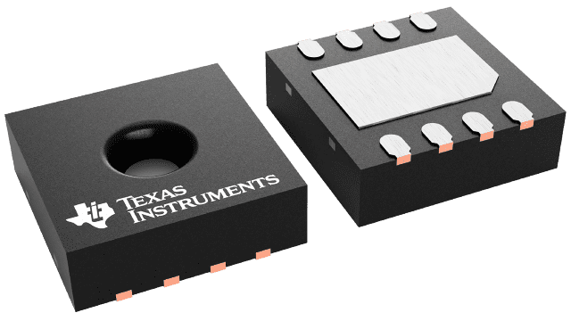
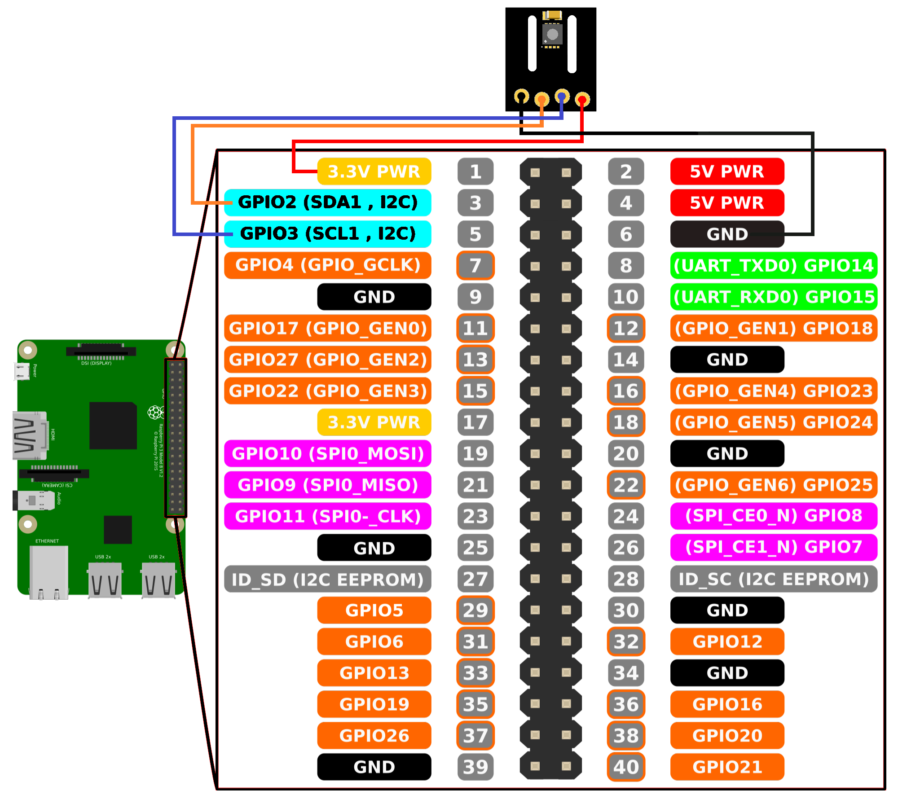

[](https://mw-technologies.at)

# HDC3020 I2C with Raspberry Pi 


 


[](https://www.ti.com/lit/ds/symlink/hdc3020.pdf) 


## QUICK START GUIDE  

### Components 
- HDC3020
- Raspberry Pi 4
- Breadboard 
- 2 x (1 kΩ - 10 kΩ) pull-ups
- Wire jumper cable <br>

| Step |                                                                                                                                                             |
|------|-------------------------------------------------------------------------------------------------------------------------------------------------------------|
| 1    | Connect the HDC3020 sensor module with Raspberry Pi according to the following scheme:<br>__Please note: For this connection scheme the I2C address is 0x44.__ <br> [](images/HDC3020_rpi.png)|
| 2    | Download and install the operating system (https://www.raspberrypi.org/software/operating-systems/).                                                            |
| 3    | Boot Raspberry Pi and complete any first-time setup if necessary (find instructions online).                                                                |
| 4    | Activate I2C communication:https://github.com/fivdi/i2c-bus/blob/master/doc/raspberry-pi-i2c.md                     |
| 5    | Download and install the "smbus2" library on the Raspberry Pi. [Instruction](https://pypi.org/project/smbus2/#:~:text=Installation%20instructions)            |
| 6    | Clone the repository: ```git clone https://github.com/MW-technologiesGmbH/HDC3020_rpi.git```  |
| 7    | Open a command shell and type following command to receive measurement data – that’s it! |


### Example output

```shell
pi@raspberrypi:~ $ python3 hdc3020_i2c_single_shot.py
	temperature , relative humidity, dewpoint
	23.41 °C , 50.64 %RH , 13,6 °C
```
<br>


### I2C address 
The sensor‘s I2C base address is 0x44 (without R/W bit). Pins ADDR and ADDR1 overrule the I2C base address.(for more information check the data sheet) <br>
<br> 
<br>

## License 
See [LICENSE](LICENSE).
